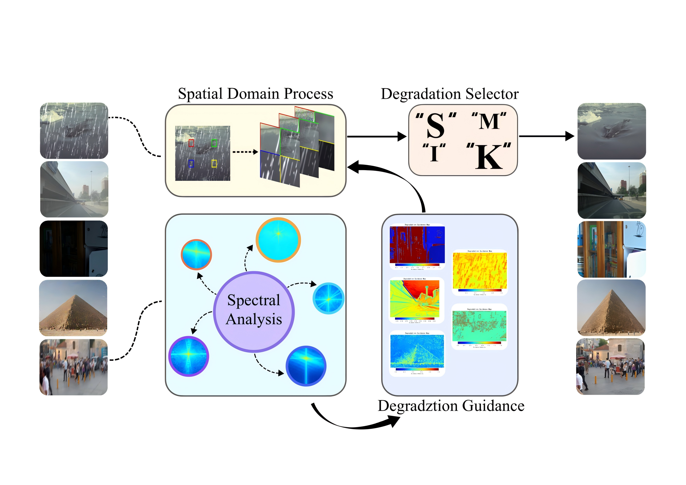

# FSDRNet
FSDRNet: A Dynamic Recovery Network Based on Frequency-Spatial Collaborative Processing

    

## Datasets
FSDRNet was trained and evaluated on the following public datasets:

### Derain
- Rain200L/Rain100L: [Download Link](https://www.icst.pku.edu.cn/struct/Projects/joint_rain_removal.html) - Click "The dataset" on the page to download

### Dehaze
- RESIDE: [Official Website](https://sites.google.com/view/reside-dehaze-datasets/)
  - SOTS-Outdoor: [Dropbox](https://bit.ly/2XZH498) or [Baidu Drive](https://pan.baidu.com/share/init?surl=SSVzR058DX5ar5WL5oBTLg) (password: s6tu)

### Denoise
- BSD400: [GitHub Download](https://github.com/smartboy110/denoising-datasets)
- BSD68: [GitHub Download](https://github.com/smartboy110/denoising-datasets) or [Berkeley Dataset](https://www2.eecs.berkeley.edu/Research/Projects/CS/vision/bsds/)
- Urban100: [Public Dataset](https://github.com/JingyiXu404/MCSCNet) in the test data section
- Kodak24: [GitHub Download](https://github.com/MohamedBakrAli/Kodak-Lossless-True-Color-Image-Suite)

### Deblur
- GoPro: [Official Website](https://seungjunnah.github.io/Datasets/gopro.html) - Contains 3,214 image pairs for deblurring training and testing

### Delol
- LOL (Low-Light): [Kaggle Download](https://www.kaggle.com/datasets/soumikrakshit/lol-dataset) - Contains 500 pairs of low-light/normal-light images

    
    
Table 1: Performance comparison with existing methods on multiple datasets

# Environment Requirements
python >= 3.7
pytorch >= 1.7.0
numpy
einops==0.4.1
opencv_python==4.6.0.66
PyYAML==6.0
scikit_image==0.19.3
scikit_learn==1.0.2
scipy==1.7.3
tensorboardX==2.1
termcolor==1.1.0
timm==0.6.7
tqdm==4.64.0
matplotlib
torchvision

## Note
The remaining code is still being organized. Please stay tuned.
